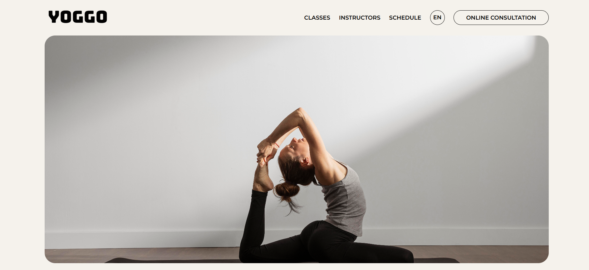
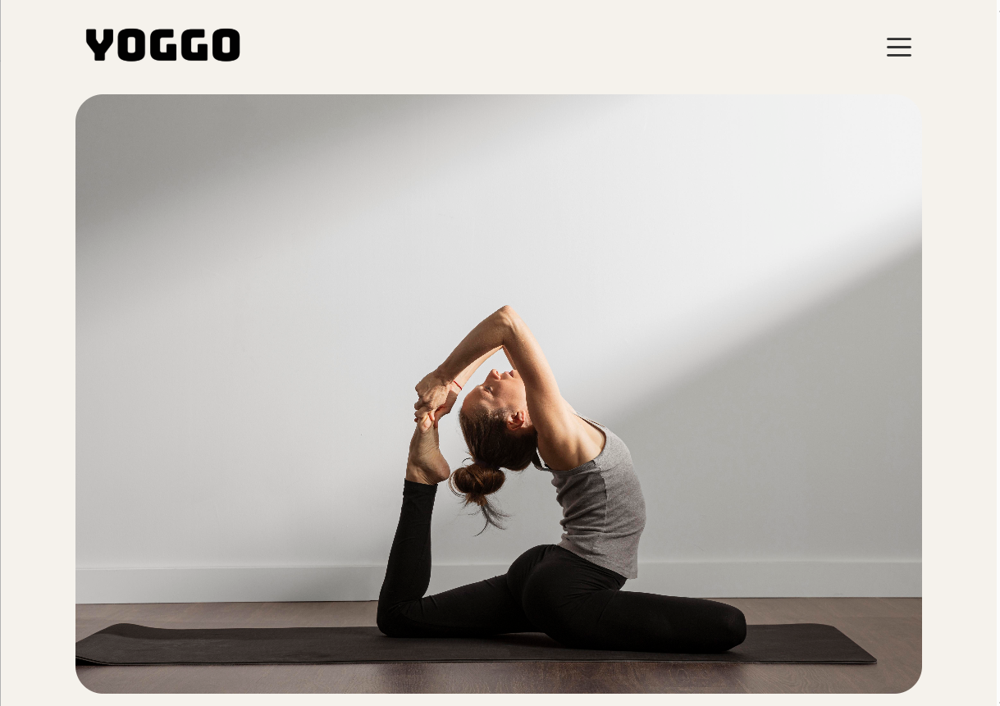
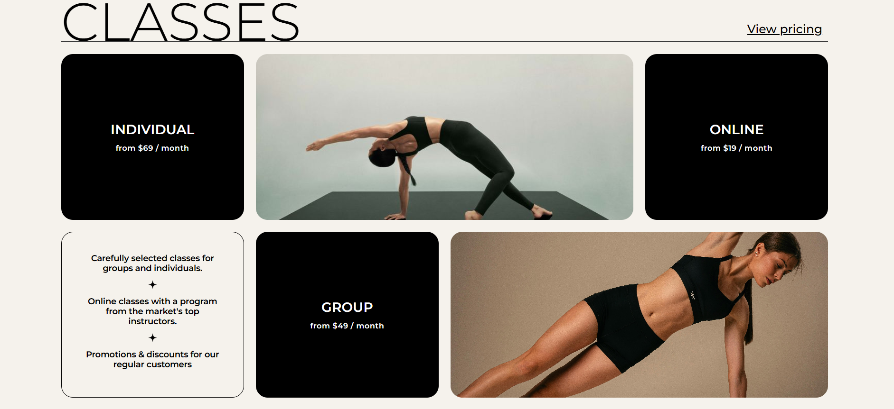
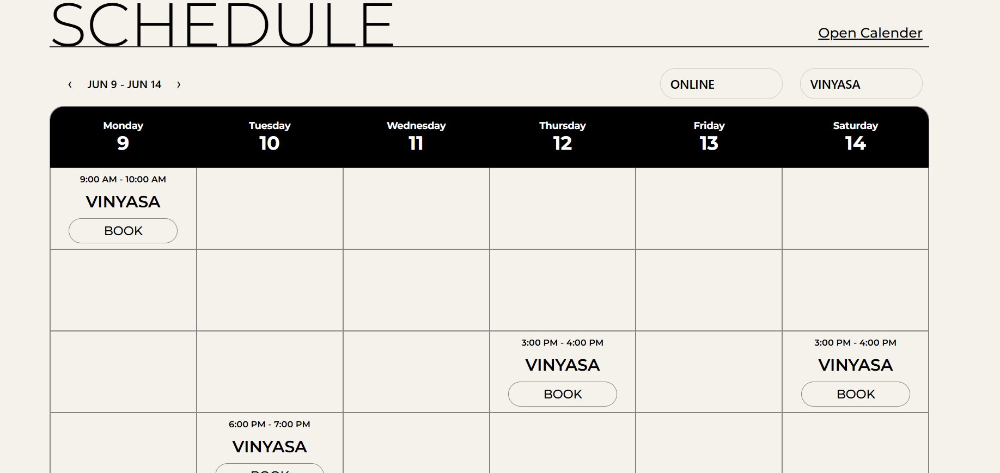
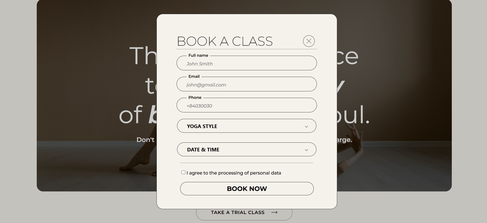

# Yoggo

# 🧘‍♀️ Yoga Studio Landing Page

Welcome to the **Yoga Studio Landing Page** — a modern, responsive website designed to promote and represent a professional yoga studio. This landing page serves as a digital front door for potential students to explore class offerings, learn about instructors, view the schedule, and sign up for trial classes.

🌐 **Live Preview:** [https://yoggo.onrender.com](https://yoggo.onrender.com)  

---

## 🎯 Features

### ✅ Modern & Responsive Design
- Built with HTML5, CSS3, and vanilla JavaScript, Jquery.
- Fully responsive layout compatible with desktops, tablets, and mobile devices.
- Smooth transitions and animations for enhanced user experience.

### 🧘‍♂️ Class Categories
- Explore various yoga styles such as Hatha, Vinyasa, Ashtanga, Yin Yoga, and Power Yoga.
- Each category includes a short description and benefits.

### 🏷️ Available Classes
- A section listing all currently offered classes with:
  - Class name
  - Difficulty level (Beginner, Intermediate, Advanced)
  - Duration and timing
  - Number of available slots

### 👩‍🏫 Meet Our Instructors
- Profiles of professional and certified yoga teachers.
- Short bios including teaching style, years of experience, and areas of expertise.

### 📅 Class Schedule
- Weekly timetable showing available classes per day and time.
- Visual and easy-to-navigate format for quick planning.

### 📝 Trial Class Registration Form
- Clean and user-friendly form for potential students to register for a free trial class.
- Input fields include: Name, Email, Preferred Class, Preferred Date.
- Form validation and submission feedback included.

---

## 🚀 Technologies Used

- HTML5
- CSS3 / Flexbox / Grid
- JavaScript (vanilla)
- Owl Carousel for sliders
- Font Awesome for icons
- Google Fonts for typography

---

## 📱 Responsive Screenshots

| Desktop | Tablet | Mobile |
|--------|--------|--------|
|  |  |  |
|  |  |  |
> *Screenshots can be added under `/screenshots` folder if available.*

---

## 📂 Project Structure

project/
├── index.html
├── css/
│ └── style.css
├── js/
│ ├── script.js
│ └── owl.carousel.min.js
├── images/
│ └── ... (yoga classes, instructors, etc.)
└── README.md

---

## 📦 Getting Started (Development)

1. Clone the repository:
   ```bash
   git clone https://github.com/Tramella/Yoggo.git

2.Open index.html in your browser.

📩 Contact
Feel free to reach out for feedback, suggestions, or collaboration:

Email: trantramella@gmail.com

🧘 Final Note
This landing page aims to deliver a calming, engaging, and informative online experience for both new and existing yoga practitioners. Whether you're a beginner or an advanced yogi, this site provides all the essentials to get started with our studio.

Made with ❤️ and mindfulness.
